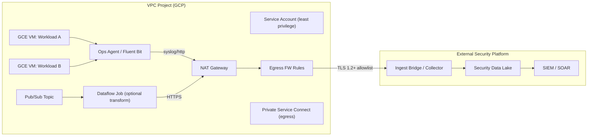

# 🔐 GCP Compute → External Security Pipelines (Outside GCP SOC)


> **Redaction statement:**  
> This repository contains **no secrets, credentials, tenant identifiers, public IPs, internal hostnames, or proprietary metadata**.  
> Example values are placeholders only — keep it that way. ✅  

---

## 🧭 Purpose

This repo documents a **clean, production-grade pattern** for connecting **GCP Compute** workloads to **external security pipelines** that live **outside the GCP SOC** (e.g., third-party SIEM/SOAR, security data lakes, MDR providers).  
It focuses on **secure log/telemetry egress** and **evidence-based detections** while preserving **least privilege** and **egress control**.

---

## 🎯 Goals

- Stream **VM telemetry** (OS logs, audit, NetFlow-like data) to an **external pipeline** securely.  
- Support **real-time and batch**: agent-based forwarding and Pub/Sub→bridge patterns.  
- Enforce **egress controls** (NAT, firewall, service accounts, restricted endpoints).  
- Provide **operational runbooks**, **cutover/rollback**, and **security controls**.  

---

## 🏗️ Reference Architecture



---

### 🔄 Lifecycle Stages

1. **Discover & Assess** → inventory VMs, data types, compliance boundaries.  
2. **Design** → choose agent vs Pub/Sub path; define controls, SLOs, and schemas.  
3. **Build** → infra, service accounts, NAT/egress, agent configs, Pub/Sub, bridge.  
4. **Integrate** → connect to external collector endpoints with mTLS or token-based auth.  
5. **Test** → functional, load, failure, red team signal tests; schema & latency checks.  
6. **Pre-Prod** → canary subset, dual-write, dashboards, on-call readiness.  
7. **Cutover** → controlled change window; verify KPIs, roll-forward if stable.  
8. **Operate** → runbooks, alerting, autoscaling, weekly health reviews.  
9. **Evolve** → iterate detectors, cost/throughput tuning, backlog grooming.  

> For detailed procedures, see: [`RUNBOOK.md`](RUNBOOK.md) and the `docs/` folder.  

---

## 🧩 Supported Patterns

- **Agent to External:** Google Ops Agent or Fluent Bit → HTTPS/syslog → external collector.  
- **Pub/Sub Bridge:** Logs → Pub/Sub → (optional Dataflow) → secure HTTPS bridge → external.  
- **Hybrid:** agent for host logs + Pub/Sub for platform/service logs.  

---

## 🚦 Non-Goals

- Not a full Terraform/IaC solution (you can add later).  
- Not vendor-opinionated—use any external SIEM/SOAR/collector that supports TLS ingest.  

---

## 📂 Repository Layout

```
.
├── README.md
├── RUNBOOK.md
├── .gitignore
├── docs/
│   ├── OVERVIEW.md
│   ├── ARCHITECTURE.md
│   ├── CUTOVER_CHECKLIST.md
│   ├── ROLLBACK.md
│   └── SECURITY.md
└── scripts/
    ├── bash/
    │   ├── 01_enable_apis.sh
    │   ├── 02_create_pubsub.sh
    │   ├── 03_ops_agent_config.sh
    │   ├── 04_firewall_egress.sh
    │   ├── sample_ops_agent_logging.yaml
    │   └── example-egress-allowlist.json
    └── powershell/
        ├── New-GcpSaAndKey.ps1
        └── Test-ExternalIngest.ps1
```

---

## 🛡️ Compliance & Redaction

- ✅ **No secrets/IDs** in repo.  
- 🔒 Use **Workload Identity Federation** or Secret Manager—never commit keys.  
- 🧯 Treat sample JSON/YAML as **illustrative only**.  

---

## 🧪 Quick Start (Lab)

```bash
# Clone, then:
git init
git add .
git commit -m "Initial commit: GCP → External Security Pipelines baseline"
git branch -M main
git remote add origin <your-remote-url>
git push -u origin main
```

---


### 📬 Support & Contributions

Open issues as needed. Keep examples redacted. Follow [`SECURITY.md`](docs/SECURITY.md) for disclosure.
